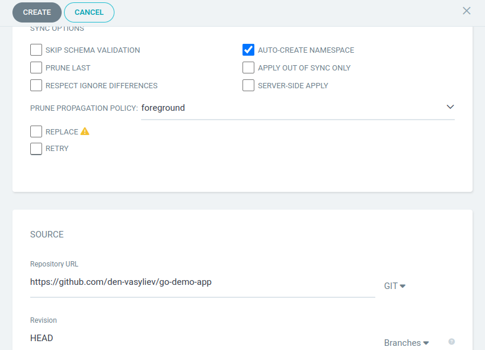
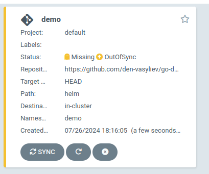
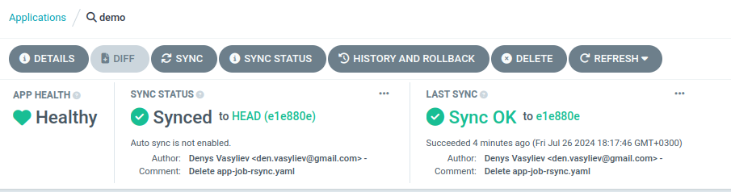
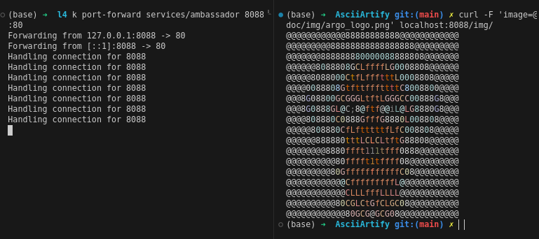

## Pulling changes from remote git repository

Create new application in Argo CD



New application created but out of sync



After sync application is up and running



## Testing the application

Open the browser and navigate forward port of the application

```sh
k port-forward services/ambassador 8088:80
```

Let's test the application by uploading this image


```sh
curl -F 'image=@doc/img/argo_logo.png' localhost:8088/img/
```

