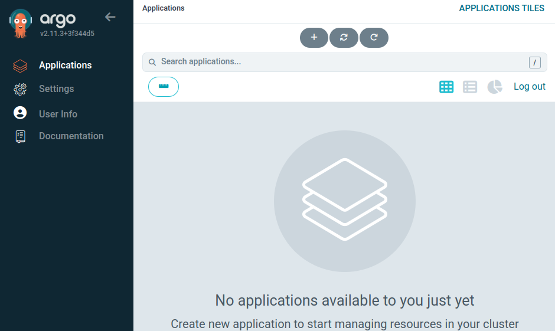

# Installation of Argo CD in a Local Kubernetes Cluster

To create a new namespace named `argocd` and install Argo CD in a Kubernetes cluster, you can follow these steps:

1. **Create the Namespace:**

   Use the following `kubectl` command to create a namespace named `argocd`:

   ```sh
   kubectl create namespace argocd
   ```

2. **Install Argo CD:**

   Use the following commands to install Argo CD in the newly created `argocd` namespace. We'll use the official manifests provided by Argo CD.

   ```sh
   kubectl apply -n argocd -f https://raw.githubusercontent.com/argoproj/argo-cd/stable/manifests/install.yaml
   ```

3. **Verify the Installation:**

   Check that the Argo CD pods are running in the `argocd` namespace:

   ```sh
   kubectl get pods -n argocd
   ```

   You should see output similar to this:

   ```
   NAME                                  READY   STATUS    RESTARTS   AGE
   argocd-application-controller-0       1/1     Running   0          1m
   argocd-dex-server-xxxxxxx             1/1     Running   0          1m
   argocd-redis-xxxxxxx                  1/1     Running   0          1m
   argocd-repo-server-xxxxxxx            1/1     Running   0          1m
   argocd-server-xxxxxxx                 1/1     Running   0          1m
   ```

4. **Access the Argo CD API Server:**

   The Argo CD API server is not exposed outside the cluster by default. You can expose it using a LoadBalancer service or a NodePort service. For simplicity, we'll use port-forwarding here.

   ```sh
   kubectl port-forward svc/argocd-server -n argocd 8080:443
   ```

   This will make the Argo CD API server available at `https://localhost:8080`.

5. **Login to Argo CD:**

   Retrieve the initial password for the `admin` user, you can get the password using this command:

   ```sh
   kubectl get secret argocd-initial-admin-secret -n argocd -o jsonpath="{.data.password}" | base64 -d
   ```

6. **Access the Argo CD UI:**

   Open your web browser and go to `https://localhost:8080`. Use the username `admin` and the password you retrieved in the previous step to log in.

Now you have successfully created a new namespace `argocd` and installed Argo CD in your Kubernetes cluster.

